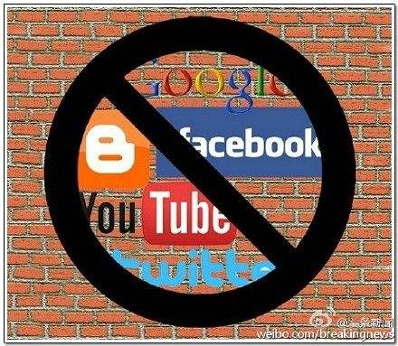

# shadowsocksR-refined version guide by kmykoh97
## 看不懂英文的人可以[私信](https://github.com/kmykoh97)问我
## Guide to break China Firewall using VPS


*In this guide, I will show you how to build your own SSR server. Beginners, please read these steps carefully.*

### Steps for building your own VPS server
1. Sign up for a new account for any vps provider you like such as aliyun, bandwagon, Vultr... In this guide, I will use [Vultr](www.vultr.com) for example
2. Follow instruction to top up your account. If you only want to try, feel free to top up just the bare minimum. You can use credit card, Paypal, Alipay...
3. Set up a server... Choose any country you like. Recommended server: Japan, Miami, Singapore, Silicon Valley..
4. Server type, choose centos6 x64. Centos7 has inbuilt firewall which might block your server. Deploy the server.
5. If you are using windows, use any software to set up ur SSR. For example popular ones are putty, xshell... Elif you are using Linux or Mac, open up terminal, run command "ssh root@<ip-address>"
4. your username will be root for most Linux servers. Password and ip could be found in you vultr webpage. You just have to do a little navigation to view it.
5. In Linux terminal page: copy, paste and run:
```linux
yum -y install wget

wget --no-check-certificate https://raw.githubusercontent.com/teddysun/shadowsocks_install/master/shadowsocksR.sh

chmod +x shadowsocksR.sh

./shadowsocksR.sh 2>&1 | tee shadowsocksR.log

```
or
```
CentOS/Debian/Ubuntu ShadowsocksR单/多端口一键管理脚本：

yum -y install wget

wget -N --no-check-certificate https://softs.fun/Bash/ssr.sh && chmod +x ssr.sh && bash ssr.sh

备用下载地址：

yum -y install wget

wget -N --no-check-certificate https://raw.githubusercontent.com/ToyoDAdoubi/doubi/master/ssr.sh && chmod +x ssr.sh && bash ssr.sh

```
6. Follow instructions to set up your server. Values I used:
```
port: 8989
encrypt: aes-256-cfb
protocol: auth_sha1_v4
obfs: plain
```
7. Reboot server
8. If needed, you can use google's traffic control algorithm-'bbr' to improve your speed. Copy and paste these lines and code in your putty, xshell or terminal:
```
yum -y install wget

wget --no-check-certificate https://github.com/teddysun/across/raw/master/bbr.sh

chmod +x bbr.sh

./bbr.sh

```
9. Finally you can download shadowsocksR client to surf freely!
Refer [Windows](https://github.com/kmykoh97/shadowsocksr-kmykoh/blob/master/windows.md),  [Mac](https://github.com/kmykoh97/shadowsocksr-kmykoh/blob/master/mac.md) or [Linux](https://github.com/kmykoh97/shadowsocksr-kmykoh/blob/master/linux.md)

Happy surfing XD

### Free shadowsocksr account:(updated 12.1.2018)
server ip: 45.77.79.68
port: 2345
password: FaLunDaFaHao@513
encrypt: aes-256-cfb
protocol: auth_sha1_v4
obfs: tls1.2_ticket_auth

server ip: 45.32.166.233
port: 8989
password: [*Please consult me*](https://github.com/kmykoh97)
encrypt: aes-256-cfb
protocol: auth_sha1_v4
obfs: plain
location: Miami
VPS: [Vultr](www.vultr.com)


please use them wisely

by kmykoh97

## 不会英文的人可以[私信](https://github.com/kmykoh97)问我
